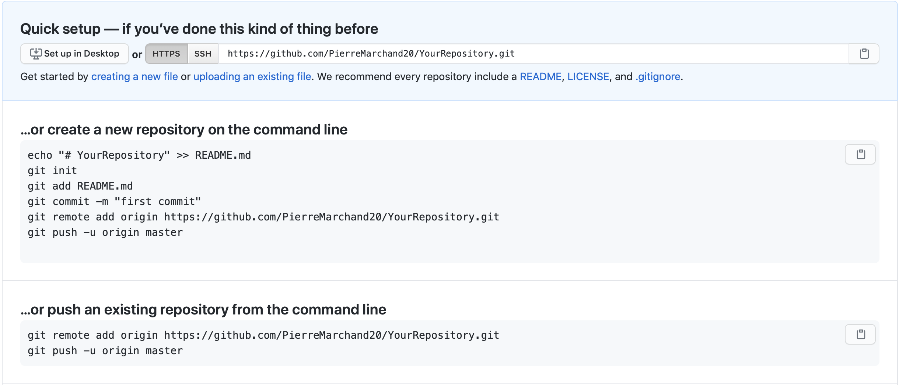

Starting with git was an obvious choice, it is the backbone of many tools nowadays, and it will be well-integrated with all the tools we will see in the following CTCW posts. That is why, we will take the time to understand its benefits, and how to use it. The presentation will be organized around what git allows you to do: versioning, remote backup, synchronization and collaborative work.

Note that I present command lines to use git, but there exists a lot of graphical interfaces (see this [list](https://git-scm.com/downloads/guis)), but understanding how git works is still necessary to use them. You can also find a [presentation]() I did a few years ago on git with a similar approach.

[Live examples](#2-examples) are available via [asciinema](https://asciinema.org) files. Note that there are not just videos, you can also copy/paste displayed command lines.

{}

## 1. Usage

### 1.1. Setup

#### Configuration

We refer to this [page](https://git-scm.com/book/fr/v2/Démarrage-rapide-Installation-de-Git) for installation instructions, but before, check if you do not already have it. Then, the first thing you need to do is to configure git. You should at least set your identity as follows:

```bash
git config --global user.name "John Doe"
git config --global user.email johndoe@example.com
```

Each modification you make to your repository will be associated with this identity.

The flag `--global` just means that this identity will be used in all the repository you work with on your system. You can always set local configuration to override it, and you can also set other types of configuration variables like the editor used to write commit message, diff tool and so on. We refer to this [page](https://git-scm.com/book/en/v2/Getting-Started-First-Time-Git-Setup) if you want to go further, but it should be enough at first. You can check your configuration with `git config --list`.

See [Example](#21-setup).

#### Create repository

To start locally a repository, go to the folder you want to work with, here `YourRepository`, and use `git init`.

This will create a hidden folder `.git` with all the information of the repository. You should not modify anything in `.git`.

See [Example](#21-setup).

### 1.2. Versioning

The first benefit of using git is that it allows you to *version* your source code. It means that git will track your files, save their history efficiently, and give you the possibility to easily navigate through the different versions of your files. Using git, you can forget about versioning your files numbering their name like `file1.txt`, `file2.txt`, `filefinal.txt`, `filefinal1.txt`, ... and all the redundancy it implies.

#### Create History

Firstly, you need to put a file, here `FirstFile.txt`, in your repository and ask git to track it. To do so, you need two commands:

```bash
git add FirstFile.txt
git commit FirstFile.txt -m "first file added"
```

The first command makes the file `FirstFile.txt` *staged*, and the second one commit this version of the file in the repository's history, with a small comment. The repository's history can be represented as a graph/tree, where each commit is a node, containing a state of the whole repository, a comment describing the commit, a unique SHA1 identifier (something like `291bb0`), the commit date, the committer's name, and email address.

By default, the first branch you create is called `master` [^1]. We will see that one repository can contain several branches, but this is an advanced subject. A branch represents a linear history of your repository, and in practice it is a pointer to the last state of a linear history.

[^1]: It is quite likely that `main` is going to be the new default name instead of `master`.



See [Example](#22-create-history).

{}

Why do you need two commands just to update your repository?

It is usually the first point that confuses people discovering git. I refer to some [discussions](#22-specific-discussions) on the subject, but the bottom line is that the staged area (so, the files you used `git add` on) allows reviewing your changes before committing them to the repository's history. It also allows separating multiple changes in meaningful commits.

For example, if you add a feature to your code, and fix a bug at the same time. You can add everything, review everything, commit the changes associated with your fix with the specific description, and then do the same for your new feature. Remember that your commit messages need to be descriptive enough to easily navigate the repository's history.

{}

#### Navigating the history

Now that you populated your history's repository, you may want to go back and check previous states of your repository. The current state on your computer (not necessarily the last one) is called `HEAD`.



The command `git log` shows your repository's history, i.e., commit messages, the unique SHA1 identifiers, committer's name, and email address.

To navigate your history, you can use

- relative references: to checkout the nth of `HEAD` use `HEAD~n`, for example for the second child `git checkout HEAD~2`.

- absolute references: using the unique SHA1 identifier, `git checkout 291bb0`
- to return to the last state of your repository, `git checkout master`.







See [Example](#23-navigating-the-history).

{}

You are lost? `git status` will tell you where you are and what you can do.

{}


### 1.3. Back up

Another advantage of git is the possibility to back up your repository in a remote server. It is said to be a *distributed* version-control system (unlike svn for example), because both your local repository and the remote repository will have the full history after each synchronization.

#### Setup the remote

First, you need to create a remote repository in [GitHub](https://github.com), [Gitlab](https://about.gitlab.com), [Bitbucket](https://bitbucket.org/) or some other providers (or your own git server). For example, using GitHub:



As described in the previous figure, we need to add the remote url to the local repository with

```bash
git remote add origin https://github.com/PierreMarchand20/YourRepository.git
```

The remote is then referenced as `origin`. And, we need to push the local commits to the remote

```bash
git push -u origin master
```



#### Working with a remote repository

Now, we create a new commit locally, so that the branch `master` is further than the branch `origin/master` on the remote.



We just need to do `git push` to update `origin/master` (by default, git will push to `origin/master`, no need to specify it).

### 1.4. Synchronization

Having a remote repository, you can also use it to synchronize a repository on several computers, let's say `Computer 1` and `Computer 2`.

#### Update from remote

Imagine you create a new commit locally on `Computer 2`, then you push this new commit to the remote repository. This time, it is `origin/master` that is further than `master` from the point of view of `Computer 1`!



To update your local repository, you just need to do `git pull`.

#### Issue

Something wrong can quickly happen with bad practices. Imagine you do a new commit locally on both computers. You push your new local commits from `Computer 2` to the remote repository. This time, `master` and `origin/master` have diverged from the point of view of `Computer 1`!



Two remarks here:

- It is usually what people discovering git fear the most! But note that it is not specific to git, if you modify one file locally on two computers, you will also have to deal with this situation. Actually, git will tell you that there is an issue if you try `git push` on `Computer 1`, and it will help you solve the issue. So git is a tool to help you deal with this situation, instead of doing everything by hand.
- That being said, you should avoid this situation because it is more likely to break your code. In the case you are just synchronizing several computers of yours, you can always `git pull` when starting to work on one computer, add/commit all your modifications, and `git push` when you have finished. You should not be in this situation if you follow this workflow.

In case you still encounter this situation (you forgot to commit a change, or to push at the end of a working session for example), we refer to the next section.

### 1.5. Collaboration

If you want to collaborate with some else, or if you work with a team on a project, then the preceding issue may occur more often. It is very likely that your coworkers will commit some changes while you are also working on the repository, so that, you will be in the situation described in the preceding [figure](#figure-repository-on-computer-1-with-diverged-master-branches). To avoid this, you need to adopt a workflow, i.e., a way to work all together with the git repository. There are several solutions depending on how you work with your team/coworkers, the number of contributors, etc. It is an advanced subject, and I give some pointers for more information in the [references](#32-specific-discussions).

But here are some general considerations shared by most of them. They usually aim at:

- making the history's repository/tree as flat as possible. This makes it easier to navigate between commits,
- avoiding situations with diverging branches, and thus, limiting the risks of breaking your code.

And, they usually rely on one of the two following git operations, if not both: `git merge` and `git rebase`. Both commands allow to merge two branches, but the outcome is different as we will see.

#### Merge

Merging is used automatically by git when pulling from a remote which is further than the local branch. But it can also be used to merge two different branches locally. Actually, `git pull` means `git fetch`, which updates locally the remote branch (here, the local copy of `origin/master`), followed by `git merge`, between the remote branch (the local copy of `origin/master`) and the local branch (`master`).

Let us take an example. We have a file `FirstFile.txt` that contains the following three lines:

```text
This is the first file
This is the first file
This is the first file
```

On `Computer 1`, we modify it to

```text
This is the first file - modified by Computer 1
This is the first file
This is the first file
```

On `Computer 2`, we modify it to

```text
This is the first file
This is the first file
This is the first file - modified by Computer 2
```

The first line is modified by `Computer 1`, and the third line is modified by `Computer 2`.

Now, we commit both changes locally, we push the modifications by `Computer 2`, and pull on `Computer 1`. Note that git is safe, if you try to push changes from `Computer 1`, it will be rejected because `master` on `Computer 1` is behind `origin/master`. When pulling on `Computer 1`, because the modifications from both computers are not overlapping, git actually proceeds to merge automatically the changes, and create a commit stating the merge. Then, you just need to push on `Computer 1`, and pull on `Computer 2`, and we obtain a history like this:



See [Example](#25-auto-merging).

Let us look at the case where the modifications are overlapping. On `Computer 2`, we do the following change instead:

```text
This is the first file - modified by Computer 2
This is the first file
This is the first file
```

If we commit locally on both computers, and we push on `Computer 2`. Then, when pulling on `Computer 1`, auto merging fails, and `FirstFile.txt` contains now:

```bash
<<<<<<< HEAD
This is the first file - modified by Computer 1
=======
This is the first file - modified by Computer 2
>>>>>>> 438c30414304658df44ef2dfd735abea47c7025a
This is the first file
This is the first file
```

We see the change from the local `HEAD` (so, `Computer 1`), and the change from the commit on the remote (so, `Computer 2`). We just need to modify `FirstFile.txt` as we want, then stage it and commit.

See [Example](#26-merging).

#### Rebase

While `git merge` creates a new commit, as illustrated [here](#figure-merging), `git rebase` just changes the base of one branch to put it after the last commit of the other branch. Taking the same example illustrated [here](#figure-repository-on-computer-1-with-diverged-master-branches), we can do `git fetch origin` on `Computer 1` to update the local copy of `origin/master`, and then `git rebase origin/master` to obtain:  



where the diverged commit `e9b2d0a` is now behind `30f00e3`. We moved the base of `master` to the tip of `origin/master`. This is particularly useful to avoid an additional commit, and in the case of two different branches, it allows preserving both history. But, there is one [golden rule](https://www.atlassian.com/git/tutorials/merging-vs-rebasing#the-golden-rule-of-rebasing) when using `git rebase`. It should **not be used with public branches** For example, you should not rebase `origin/master` instead of `master`, because it would modify the commit history of the branch shared with others.

## 2. Examples

You can find here live terminal session via [asciinema](https://asciinema.org) videos. There are not just videos, you can also copy/paste displayed command lines.

### 2.1. Setup



### 2.2. Create History



### 2.3. Navigating the history

Remark how `HEAD` is said to be on master when on the third commit, but not the others.



### 2.3. Adding remote

Note how `origin/master` appears now when using `git log`.



### 2.4. Working with remote

Note that `origin/master` appears on the third commit, while `HEAD` and `master` are on the fourth commit after `git commit`.



### 2.5. Auto merging



### 2.6. Merging



## 3. References

### 3.1. General presentations

- [Pro Git book](https://git-scm.com/book/en/v2) by Scott Chacon and Ben Straub, free and available in several languages.
- [Introduction to Git with Scott Chacon of GitHub](https://www.youtube.com/watch?v=ZDR433b0HJY) on YouTube.
- An interesting discussion on Quora: [What is git and why should I use it?](https://www.quora.com/What-is-Git-and-why-should-I-use-it).
  
### 3.2. Specific discussions

- Discussions on why you need to add and commit [here](https://stackoverflow.com/questions/49228209/whats-the-use-of-the-staging-area-in-git) and [there](https://stackoverflow.com/questions/4878358/why-would-i-want-stage-before-committing-in-git).
- Several possible workflows for teams are described [here](https://www.atlassian.com/git/tutorials/comparing-workflows) by Atlassian.
- Lists of GUIs [here](https://git-scm.com/downloads/guis).

### 3.3. Other tutorials

- [Tutorial](https://infomath.pages.math.cnrs.fr/tutorial/git/) of Infomath

### 3.4. To go further

- [Stashing](https://git-scm.com/book/en/v2/Git-Tools-Stashing-and-Cleaning)
- [Submodules](https://git-scm.com/book/en/v2/Git-Tools-Submodules)
- [Branches](https://git-scm.com/book/en/v2/Git-Branching-Branches-in-a-Nutshell)
